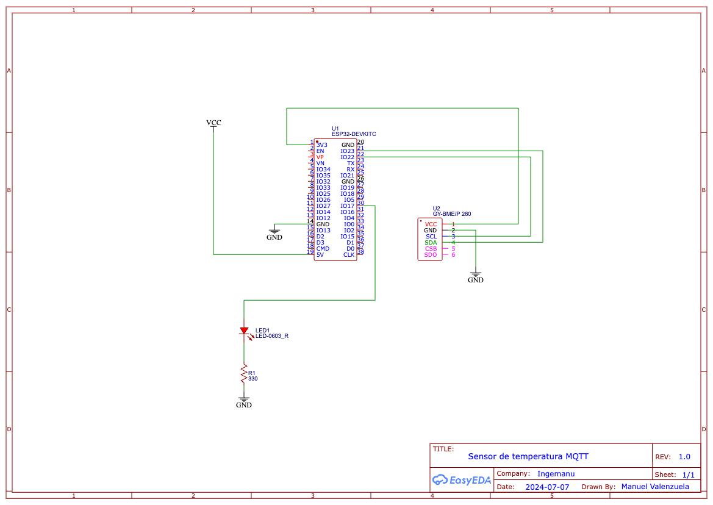

# mqtt-temperature-sensor
BMP280 sensor that connects to ESP32 and sends data over MQTT

## How to run
Replace the following code with your wifi SSID (Network name) and password

```c
char ssid[] = "YOUR-SSID";
char pass[] = "YOUR-WIFI-PASSWORD";
```

## Schematic



